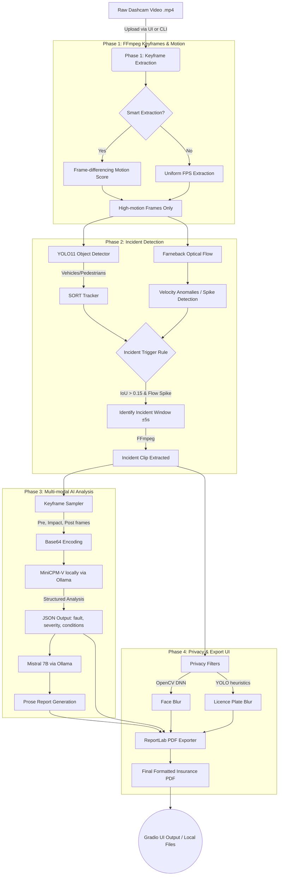

# Local AI Dashcam Incident Explainer

> A fully local, privacy-preserving dashcam incident analysis system for Computer Vision coursework.  
> **No cloud APIs · No internet required · Runs on MacBook or any Linux PC**

---

## 🏗 End-to-End System Architecture



---

## ⚙️ Phase-by-Phase Technical Breakdown

### Phase 1 — Keyframe Extraction (`src/phase1/`)
This phase handles the initial video ingestion and frame sampling.
- **Tools**: `FFmpeg` 
- **Implementation Mechanism**: The system can extract frames at a uniform configurable FPS (e.g., 5 or 10 FPS) using `extract_keyframes.py`. To optimize performance on long dashcam videos, a **smart mode** (`motion_detector.py`) is employed. It calculates an absolute frame-difference motion score between consecutive frames. Frames are only saved to disk if the motion score exceeds a dynamic threshold. This intelligently reduces computational load by skipping static or slow scenes (e.g., waiting at a red light).

### Phase 2 — Incident Detection Core (`src/phase2/`)
This is the classical Computer Vision and Deep Learning core that finds exactly *when* an incident occurs so we don't send an entire hour of video to a resource-intensive Vision-Language Model.
- **YOLO11 Detector**: Runs object detection inference on the extracted keyframes (`detector.py`). The system selectively filters for relevant COCO classes (`{0, 1, 2, 3, 5, 7}` which map to people, bicycles, cars, motorcycles, buses, and trucks).
- **SORT Tracker**: (Simple Online and Realtime Tracking) implementation (`tracker.py`). Bounding boxes from YOLO are tracked across consecutive frames. The network predicts the next state using constant-velocity Kalman filters and assigns identities by correlating Bounding Box IoU (Intersection over Union) via the Hungarian Algorithm.
- **Farneback Optical Flow**: A dense optical flow algorithm (`optical_flow.py`) computes the per-pixel velocity vector to understand global motion dynamics. The system calculates a rolling average of scene velocity over a 30-frame window and flags spikes (instances moving faster than `mean + k * std`).
- **Trigger Logic**: The overall incident extractor (`incident_extractor.py`) fuses the SORT stream and the flow stream. If two tracked bounding boxes converge (IoU > 0.15, indicating a collision or near-miss) AND there is a simultaneous optical flow velocity anomaly spike, an incident is definitively flagged. The system relies on FFmpeg to automatically slice a highly targeted ±5-second clip surrounding the pivotal event.

### Phase 3 — VLM Narration (`src/phase3/`)
Translating visual pixels into profound semantic textual understanding.
- **Keyframe Selection**: `keyframe_sampler.py` is invoked to select the single best "Impact" frame, along with essential context frames: "Pre-impact" and "Post-impact". 
- **MiniCPM-V via Ollama**: These 3 frames are base64 encoded and fed directly to MiniCPM-V 2.6 (`vlm_narrator.py`), a powerful 8B vision-language model running completely locally. The instruction prompt leverages structured output formatting to strictly mandate that the LLM returns valid JSON. The JSON maps keys like `vehicles`, `fault_analysis`, `conditions`, `severity`, and a chronological `timeline`. A confidence flag is attached if hedging terminology (e.g., "might", "potentially") is detected.
- **Mistral 7B Prose**: The structured JSON payload is then securely piped to Mistral `report_generator.py` to synthesize a well-formatted, human-readable, professional insurance prose narrative.

### Phase 4 — Privacy and UI Delivery (`src/phase4/`)
Before exporting or persisting records, visual data is robustly sanitized, and the system is surfaced through an accessible user interface.
- **Privacy Enforcement (`privacy.py`)**:
    - **Face Blurring**: Uses an OpenCV Deep Neural Network (`SSD ResNet10`) structure to highly accurately detect driver and pedestrian faces in the immediate crash zone and apply deep Gaussian blurring. It implements Haar Cascades as an emergency structural fallback.
    - **Licence Plate (LP) Blurring**: Reuses the YOLO vehicle crops combined with an intelligent heuristic Region-of-Interest (ROI) mapping algorithm to automatically locate and obscure licence plates without the immense overhead of needing a separate, heavy ALPR (Automated Licence Plate Recognition) network inference cycle.
- **PDF Generation (`pdf_exporter.py`)**: Employs the `ReportLab` library to seamlessly stitch together the Mistral prose report, the MinCPM-V structured JSON metadata, auto-coloured severity badges, and the privacy-blurred keyframe thumbnails into a highly polished, professional `project_report.pdf` which can be handed directly to insurance providers.
- **Gradio User Interface (`app.py`)**: Mounts the entire autonomous infrastructure onto a web server running locally via `http://localhost:7860`. Users are greeted with an intuitive drag-and-drop video upload zone, can watch raw terminal backend logs stream in real-time, and download their finalized PDF formats and MP4 incident clips immediately.

### Phase 5 — System Evaluation (`src/phase5/`)
Dedicated metric calculation for academic, performance, and practical system validation.
- **Evaluation Tooling (`evaluate.py`)**: Ground-truth benchmarking and reporting use sophisticated NLP metrics including **BLEU-4** (Bilingual Evaluation Understudy) and **ROUGE-L** (Recall-Oriented Understudy for Gisting Evaluation). These compare the generated local LLM prose directly against human-annotated summaries from validated traffic datasets like CCD, DoTA, and DADA-2000.

---

## 📋 Requirements

| Requirement | Minimum |
|---|---|
| Python | 3.10+ |
| RAM | 8 GB (16 GB recommended) |
| Disk | 10 GB (for model weights) |
| CPU/GPU | Any (MPS/CUDA auto-detected) |
| OS | macOS 12+ / Ubuntu 20.04+ |

Software prerequisites:
- [Ollama](https://ollama.com/) — local LLM/VLM runtime
- [FFmpeg](https://ffmpeg.org/) — video processing

---

## 🚀 Quick Start

### 1. Install Prerequisites

```bash
# macOS
brew install ffmpeg
# Install Ollama from https://ollama.com/download
```

### 2. Setup Project

```bash
cd "Local AI Dashcam Incident Explainer"
chmod +x setup.sh
./setup.sh
```

This will:
- Create a Python virtual environment
- Install all dependencies
- Pull `minicpm-v` and `mistral` via Ollama

### 3. Activate Environment

```bash
source .venv/bin/activate
```

### 4. Run Full Pipeline (CLI)

```bash
python3 src/phase3/pipeline.py \
    --video data/samples/your_dashcam.mp4 \
    --keyframes 3
```

### 5. Launch Web UI

```bash
python3 src/phase4/app.py
# Open http://localhost:7860
```

---

## 📁 Project Structure

```
.
├── requirements.txt          # Python dependencies
├── setup.sh                  # One-command environment setup
├── data/
│   └── samples/              # Place dashcam videos here
├── outputs/
│   ├── keyframes/            # Extracted frames
│   ├── incidents/            # ±5s incident clips
│   └── reports/              # JSON + TXT + PDF reports
├── src/
│   ├── phase1/
│   │   ├── extract_keyframes.py    # FFmpeg uniform & smart modes
│   │   └── motion_detector.py      # Frame-differencing motion score
│   ├── phase2/
│   │   ├── detector.py             # YOLO11 vehicle/person/moto detector
│   │   ├── tracker.py              # SORT IoU tracker
│   │   ├── optical_flow.py         # Farneback flow + spike detector
│   │   └── incident_extractor.py   # Incident trigger + clip export
│   ├── phase3/
│   │   ├── keyframe_sampler.py     # Pre/impact/post frame selector
│   │   ├── vlm_narrator.py         # Ollama VLM structured JSON output
│   │   ├── report_generator.py     # Mistral prose report
│   │   └── pipeline.py             # ← Main CLI entry point
│   ├── phase4/
│   │   ├── privacy.py              # LP & face blurring
│   │   ├── pdf_exporter.py         # ReportLab PDF builder
│   │   └── app.py                  # ← Gradio web UI
│   └── phase5/
│       └── evaluate.py             # BLEU/ROUGE + ablation
└── docs/
    └── system_architecture_and_flow.md # Deep-dive documentation
```

---

## 🔧 Usage Examples

### Single image VLM test
```bash
python3 src/phase3/vlm_narrator.py \
    --frames data/samples/frame.jpg \
    --model minicpm-v
```

### Motion detection only
```bash
python3 src/phase1/motion_detector.py --video data/samples/test.mp4 --threshold 8
```

### Incident detection only
```bash
python3 src/phase2/incident_extractor.py --video data/samples/test.mp4
```

### Ablation study (1/3/5 keyframes)
```bash
python3 src/phase5/evaluate.py ablation \
    --video data/samples/test.mp4 --vlm minicpm-v
```

### Score reports against references
```bash
python3 src/phase5/evaluate.py score \
    --refs data/references/ \
    --gens outputs/reports/
```

---

## 📊 Supported Datasets

| Dataset | Use |
|---|---|
| [CCD](https://github.com/MoonBlvd/tad-IROS2019) | Car crash detection |
| [DoTA](https://github.com/MoonBlvd/Detection-of-Traffic-Anomaly) | Anomaly detection |
| [DADA-2000](https://github.com/JWFangit/LOTVS-DADA) | Driver attention + accident |

---

## 🔒 Privacy Features

| Feature | Method |
|---|---|
| Licence plate blurring | YOLO11 vehicle crop + heuristic LP region + Gaussian blur |
| Face blurring | OpenCV DNN (SSD ResNet10) + Haar cascade fallback |

---

## 📜 License

MIT — for educational / research use.


