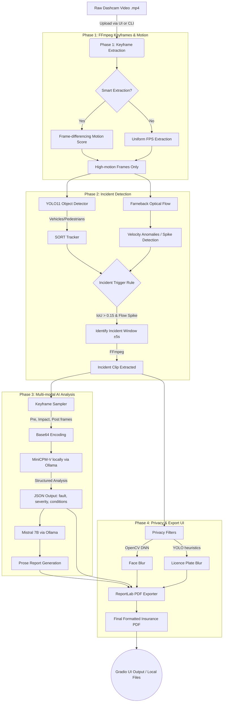

# Local AI Dashcam Incident Explainer: End-to-End System Documentation

## Executive Summary
The **Local AI Dashcam Incident Explainer** is a fully local, privacy-preserving incident analysis system. It processes raw dashcam footage, detects traffic incidents (like car crashes or sudden anomalies) using advanced Computer Vision techniques (YOLO11, SORT, Optical Flow), and leverages local Vision-Language Models (MinCPM-V) and Large Language Models (Mistral) via Ollama to generate structured JSON and prose insurance reports. All processing runs entirely on local hardware (e.g., an Apple M-series MacBook or a Linux PC), ensuring no sensitive data is sent to the cloud.

---

## End-to-End System Architecture

The following diagram illustrates the complete data flow from video ingestion to the final PDF generation.

---

## Phase-by-Phase Technical Breakdown

### Phase 1 — Keyframe Extraction (`src/phase1/`)
This phase handles the initial video ingestion and frame sampling.
- **Tools**: `FFmpeg` 
- **Implementation Mechanism**: The system can extract frames at a uniform configurable FPS (e.g., 5 or 10 FPS) using `extract_keyframes.py`. To optimize performance on long dashcam videos, a **smart mode** (`motion_detector.py`) is employed. It calculates an absolute frame-difference motion score between consecutive frames. Frames are only saved to disk if the motion score exceeds a dynamic threshold. This intelligently reduces computational load by skipping static or slow scenes (e.g., waiting at a red light).

### Phase 2 — Incident Detection Core (`src/phase2/`)
This is the classical Computer Vision and Deep Learning core that finds exactly *when* an incident occurs so we don't send an entire hour of video to a resource-intensive Vision-Language Model.
- **YOLO11 Detector**: Runs object detection inference on the extracted keyframes (`detector.py`). The system selectively filters for relevant COCO classes (`{0, 1, 2, 3, 5, 7}` which map to people, bicycles, cars, motorcycles, buses, and trucks).
- **SORT Tracker**: (Simple Online and Realtime Tracking) implementation (`tracker.py`). Bounding boxes from YOLO are tracked across consecutive frames. The network predicts the next state using constant-velocity Kalman filters and assigns identities by correlating Bounding Box IoU (Intersection over Union) via the Hungarian Algorithm.
- **Farneback Optical Flow**: A dense optical flow algorithm (`optical_flow.py`) computes the per-pixel velocity vector to understand global motion dynamics. The system calculates a rolling average of scene velocity over a 30-frame window and flags spikes (instances moving faster than `mean + k * std`).
- **Trigger Logic**: The overall incident extractor (`incident_extractor.py`) fuses the SORT stream and the flow stream. If two tracked bounding boxes converge (IoU > 0.15, indicating a collision or near-miss) AND there is a simultaneous optical flow velocity anomaly spike, an incident is definitively flagged. The system relies on FFmpeg to automatically slice a highly targeted ±5-second clip surrounding the pivotal event.

### Phase 3 — VLM Narration (`src/phase3/`)
Translating visual pixels into profound semantic textual understanding.
- **Keyframe Selection**: `keyframe_sampler.py` is invoked to select the single best "Impact" frame, along with essential context frames: "Pre-impact" and "Post-impact". Based on internal ablation studies, providing precisely 3 frames offers the optimal balance of computation speed and VLM context understanding.
- **MiniCPM-V via Ollama**: These 3 frames are base64 encoded and fed directly to MiniCPM-V 2.6 (`vlm_narrator.py`), a powerful 8B vision-language model running completely locally. The instruction prompt leverages structured output formatting to strictly mandate that the LLM returns valid JSON. The JSON maps keys like `vehicles`, `fault_analysis`, `conditions`, `severity`, and a chronological `timeline`. A confidence flag is attached if hedging terminology (e.g., "might", "potentially") is detected.
- **Mistral 7B Prose**: The structured JSON payload is then securely piped to Mistral `report_generator.py` to synthesize a well-formatted, human-readable, professional insurance prose narrative.

### Phase 4 — Privacy and UI Delivery (`src/phase4/`)
Before exporting or persisting records, visual data is robustly sanitized, and the system is surfaced through an accessible user interface.
- **Privacy Enforcement (`privacy.py`)**:
    - **Face Blurring**: Uses an OpenCV Deep Neural Network (`SSD ResNet10`) structure to highly accurately detect driver and pedestrian faces in the immediate crash zone and apply deep Gaussian blurring. It implements Haar Cascades as an emergency structural fallback.
    - **Licence Plate (LP) Blurring**: Reuses the YOLO vehicle crops combined with an intelligent heuristic Region-of-Interest (ROI) mapping algorithm to automatically locate and obscure licence plates without the immense overhead of needing a separate, heavy ALPR (Automated Licence Plate Recognition) network inference cycle.
- **PDF Generation (`pdf_exporter.py`)**: Employs the `ReportLab` library to seamlessly stitch together the Mistral prose report, the MinCPM-V structured JSON metadata, auto-coloured severity badges, and the privacy-blurred keyframe thumbnails into a highly polished, professional `project_report.pdf` which can be handed directly to insurance providers.
- **Gradio User Interface (`app.py`)**: Mounts the entire autonomous infrastructure onto a web server running locally via `http://localhost:7860`. Users are greeted with an intuitive drag-and-drop video upload zone, can watch raw terminal backend logs stream in real-time, and download their finalized PDF formats and MP4 incident clips immediately.

### Phase 5 — System Evaluation (`src/phase5/`)
Dedicated metric calculation for academic, performance, and practical system validation.
- **Evaluation Tooling (`evaluate.py`)**: Ground-truth benchmarking and reporting use sophisticated NLP metrics including **BLEU-4** (Bilingual Evaluation Understudy) and **ROUGE-L** (Recall-Oriented Understudy for Gisting Evaluation). These compare the generated local LLM prose directly against human-annotated summaries from validated traffic datasets like CCD, DoTA, and DADA-2000.
- **Ablation Studies**: Internal system tooling designed to continuously prove architecture micro-decisions. For example, quantifying and demonstrating that parsing 1 frame fundamentally misses vital pre/post context, while parsing 5 frames takes twice as long computationally with almost marginal ROUGE improvement over the established 3-frame approach.

---

## Hardware & Software Requirements

| Parameter | Recommended Specification |
| :--- | :--- |
| **Processor Frameworks** | Apple Silicon (M1/M2/M3) strictly using MPS framework, or NVidia GPU equivalent auto-detected utilizing CUDA cores. Compatible with general CPU. |
| **System Memory (RAM)** | Minimum 8 GB. Ideally 16 GB+ for unimpeded 8B parameters context swap. |
| **Storage Availability** | 10 GB exclusively reserved for local model `.gguf` weights. |
| **Python Version** | > 3.10 natively mapped to environment. |
| **Core External Tooling** | Requirements tightly couple `FFmpeg` logic alongside the `Ollama` continuous daemon application. |
